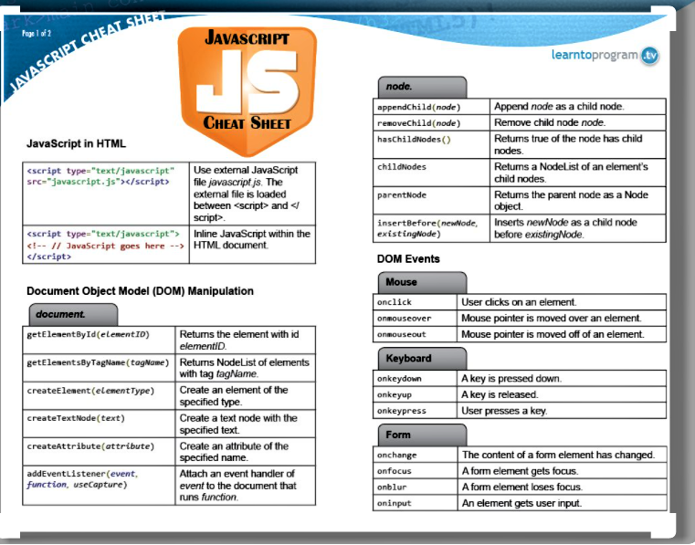

# Understanding The Problem Domain Is The Hardest Part Of Programming

* Why problem domains are hard : understanding the problem domain is the hardest thing of coding  the problem. If you don't understand the problem domain correctly before you start coding it,you will then find your self in the start point to understand what is the wrong and therefor wasting more and more time to recoding the same problem.
* rogramming is easy if you understand the problem domain : if you understand the problem domain correctly before you start the coding it will be so easier to start coding. you can do that by breaking the whole problem into sub problems and understand each of those sub problems and then you will find how it is much easire to start writing your code.

# Chapter 3 - Object Literals (pp.100-105)

* WHAT IS AN OBJECT? you can say that an object is a thought of a real world model . It groups a sety of variables(in object we called them properities) and a set of functions(in object we called them methods).example

    ```js
    var hotel = {
    name: 'Quay',
    rooms : 40,
    booked: 25,
    checkAvailability: function() {
    return this.rooms - this.booked;
    }
    } ;
    ```

* in an object the properities and functions have a name and value . we call the name key in object.
* Creating an object using literal notation : we can create an object by declaring the name of that object followed by equal sign and curly braces and inside curly braces we assign the properties and methods.
* each property or method has a key followed by colon and then the value.
* we can access the object properties and methods by writing the name of the object then dot notation followed by the property or method of that object.
* we can also access the object properties and not object methods by the name of the object then square bracket and inside square bracket we insert the property key.
  

# Chapter 5 - Document Object Model (pp.183-242)

* Document object model (DOM) is simply converting html page by browsers to an object.
* It is not a part from neither html nor javascript files but it is a set of rules was written by browsers makers and is stored in browser memory.
* it consists of four types of node :
  1. Document Node : it is the first node in the DOM tree and through of it we can access any element inside the page.
  2. ELement nodes : you can access any element by searching on it in the DOM tree and updating it.
  3. Attribute nodes : you may need to access an element and update some attribute value.
  4. Text nodes : text nodes has no children in the DOM tree..

* Accessing and updating the DOM tree involves two steps:
  1. Locate the node that represents the element you want to work with.
     1. access one element : `getElementByld (),querySe1ector ()`
     2. access multiple elements : `getElementsByClassName(),getElementsByTagName(),querySelectorAll()`.
     3. traversing between node elements : `parentNode ,previousSibling / nextSibling,firstChild / lastChild`
  2. Use its text content, child elements, and attributes.
     1. modify the text of node using element first child and `nodeValue`
     2. `innerHTML, textContent` to access text content. 
     3. ACCESS OR UPDATE ATTRIBUTE VALUES : we can use these methods to access the attributes `hasAttribute() getAttribute() setAttribute()removeAttribute()`.

.


   
